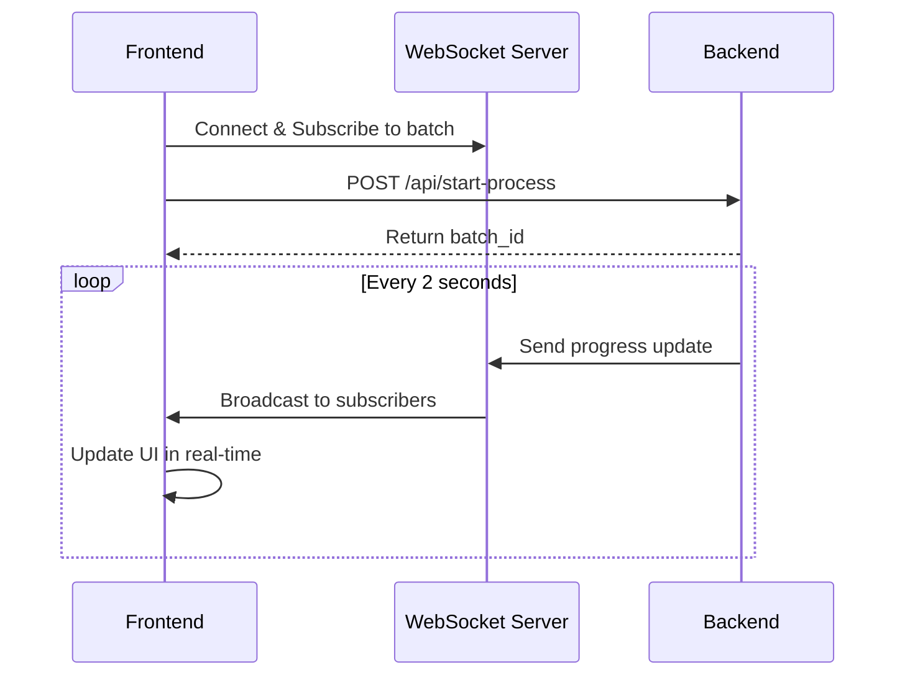

# WebSocket Tutorial Monorepo

A full-stack real-time processing application with multiple concurrent process support, built with FastAPI, Socket.IO, and Next.js.

## 🏗️ Architecture

```
websocket_tutorial/
├── backend/           # FastAPI backend with UV package manager
├── websocket-server/  # Node.js Socket.IO server
├── frontend/          # Next.js React frontend
└── package.json       # Root package.json for monorepo scripts
```

## 🚀 Features

- **Real-time Processing**: Long-running processes with live progress updates
- **Multiple Concurrent Processes**: Start and monitor multiple processes simultaneously
- **WebSocket Communication**: Real-time updates via Socket.IO
- **Fallback Recovery**: Manual batch status checking for network interruptions
- **Modern Stack**: FastAPI + Socket.IO + Next.js + TypeScript
- **Package Management**: UV for Python, Yarn for Node.js

## 🛠️ Tech Stack

### Backend (FastAPI)
- **Python 3.11+** with UV package manager
- **FastAPI** for REST API
- **Python Socket.IO** client for real-time communication
- **Pydantic** for data validation
- **AsyncIO** for concurrent processing

### WebSocket Server (Node.js)
- **Node.js** with TypeScript
- **Socket.IO** for real-time communication
- **Express** for health endpoints
- **CORS** enabled for cross-origin requests

### Frontend (Next.js)
- **Next.js 15** with App Router
- **TypeScript** for type safety
- **Tailwind CSS** for styling
- **Socket.IO Client** for real-time updates
- **React Hooks** for state management

## 🏃‍♂️ Quick Start

### Prerequisites
- **Node.js 18+**
- **Python 3.11+**
- **UV** (Python package manager)
- **Yarn** (Node.js package manager)

### Installation

1. **Clone the repository:**
```bash
git clone https://github.com/vijay-fs/websocker_experimentations.git
cd websocker_experimentations
```

2. **Install all dependencies:**
```bash
yarn install:all
```

3. **Start all services:**
```bash
yarn dev
```

This will start:
- 🔥 **Backend**: http://localhost:8000
- 🌐 **Frontend**: http://localhost:3000  
- 🔌 **WebSocket Server**: http://localhost:8001

## 📡 API Endpoints

### Backend (FastAPI)
- `POST /api/start-process` - Start a new long-running process
- `GET /api/batch-status/{batch_id}` - Get process status by batch ID
- `GET /api/health` - Health check endpoint

### WebSocket Server
- `GET /health` - Health check endpoint
- `GET /status` - Connection status and client info
- **Socket Events:**
  - `subscribe_to_batch` - Subscribe to process updates
  - `unsubscribe_from_batch` - Unsubscribe from process updates
  - `batch_progress` - Receive real-time progress updates

## 🎯 Usage

1. **Open the frontend** at http://localhost:3000
2. **Start processes** by clicking "Start New Long Process"
3. **Monitor real-time updates** in the process cards
4. **Start multiple processes** concurrently to see parallel processing
5. **Use manual batch check** for recovery if WebSocket disconnects

### Process Flow



## 🔧 Development

### Individual Services

**Backend only:**
```bash
cd backend
uv run uvicorn main:app --reload --port 8000
```

**WebSocket Server only:**
```bash
cd websocket-server
yarn dev
```

**Frontend only:**
```bash
cd frontend
npm run dev
```

### Available Scripts

```bash
# Start all services
yarn dev

# Install all dependencies
yarn install:all

# Individual service commands
yarn dev:frontend    # Start Next.js frontend
yarn dev:websocket   # Start Socket.IO server
yarn dev:backend     # Start FastAPI backend
```

## 🏗️ Project Structure

```
├── backend/
│   ├── main.py              # FastAPI application
│   ├── pyproject.toml       # Python dependencies
│   └── .venv/               # Python virtual environment
│
├── websocket-server/
│   ├── src/
│   │   └── server.ts        # Socket.IO server
│   ├── package.json         # Node.js dependencies
│   └── tsconfig.json        # TypeScript configuration
│
├── frontend/
│   ├── app/
│   │   └── page.tsx         # Main application page
│   ├── hooks/
│   │   └── useSocket.ts     # Socket.IO React hook
│   ├── package.json         # Next.js dependencies
│   └── tailwind.config.js   # Tailwind configuration
│
└── package.json             # Monorepo root configuration
```

## 🌟 Key Features Explained

### Multiple Concurrent Processing
- Start unlimited concurrent processes
- Each process runs independently
- Real-time progress tracking for all processes
- Visual distinction between active/completed processes

### Real-time Updates
- Live progress bars with smooth animations
- Message streaming ("Processing...", "Extracting...", "Detecting...")
- Automatic completion detection
- Connection status indicators

### Network Resilience
- Automatic WebSocket reconnection
- Manual batch status checking fallback
- Error handling and user feedback
- Connection retry with exponential backoff

### Modern UI/UX
- Responsive design with Tailwind CSS
- Process cards with individual controls
- Real-time counters and statistics
- Clean, professional interface

## 🐛 Troubleshooting

**WebSocket connection fails:**
- Ensure all services are running on correct ports
- Check CORS configuration in WebSocket server
- Verify no firewall blocking ports 8001

**Backend can't connect to WebSocket server:**
- Ensure `aiohttp` is installed: `uv add aiohttp`
- Check WebSocket server is running on port 8001
- Verify Socket.IO server accepts connections

**Frontend not updating:**
- Check browser console for connection errors
- Verify WebSocket server logs show client connections
- Ensure proper subscription to batch IDs

## 📝 License

MIT License - see LICENSE file for details.

## 🤝 Contributing

1. Fork the repository
2. Create a feature branch
3. Make your changes
4. Test all services work together
5. Submit a pull request

---

Built with ❤️ using modern web technologies for real-time applications.