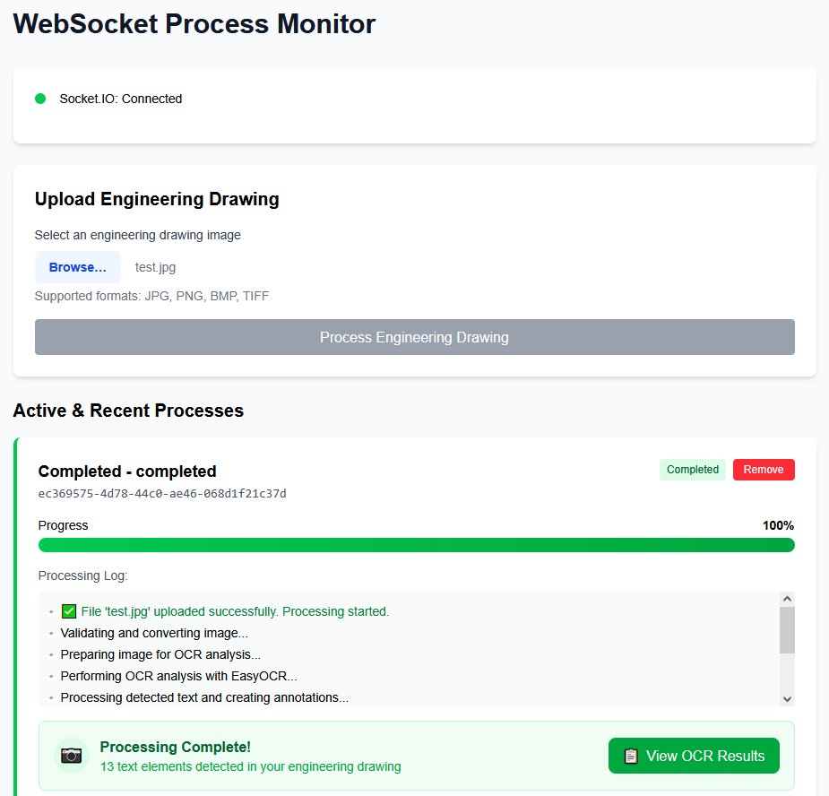
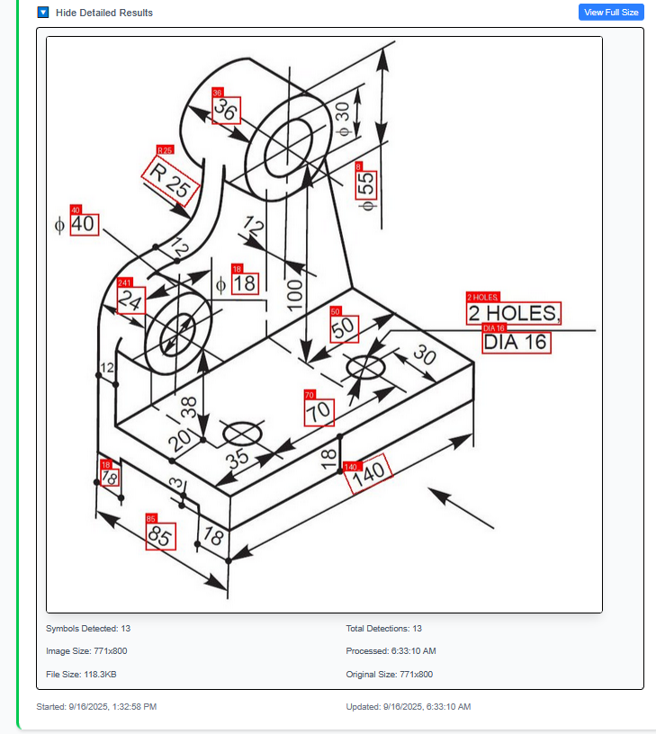

# Real-Time OCR Engineering Drawing Processor

A full-stack application for processing engineering drawings with real-time OCR text detection and Pusher-based progress updates.

## Demo


*Real-time processing interface with progress tracking*


*OCR results with annotated engineering drawing*

## Features

### Core Functionality
- **Real-Time OCR Processing**: Uses EasyOCR for accurate text detection in engineering drawings
- **Live Progress Updates**: WebSocket-based real-time progress tracking with detailed status messages
- **Multi-Format Support**: Supports JPG, PNG, BMP, and TIFF image formats
- **Image Optimization**: Automatic compression and resizing for efficient transmission

### User Interface
- **File Upload Interface**: Drag-and-drop file selection with format validation
- **Progress Visualization**: Animated progress bars with current processing step indicators
- **Toast Notifications**: Success, error, and info notifications with auto-dismiss
- **Responsive Design**: Modern, clean interface with hover effects and transitions

### Results Display
- **Processed Image Viewer**: Click-to-expand  annotated images with OCR markings
- **Processing Statistics**: Image dimensions, file sizes, detection counts, and processing time
- **Full-Size Image View**: Open processed images in new window for detailed inspection
- **Collapsible Results**: Expandable sections for detailed OCR analysis

### Real-Time Features
- **Pusher WebSocket Connection**: Live connection status indicator with Pusher
- **Process Monitoring**: Track multiple concurrent processing jobs
- **Automatic Recovery**: Reconnection handling and batch status restoration
- **Persistent State**: Process history maintained across browser sessions

## Tech Stack

### Backend
- **FastAPI**: High-performance Python web framework
- **EasyOCR**: Advanced OCR library for text detection
- **Pillow**: Image processing and manipulation
- **Pusher**: Real-time WebSocket communication service
- **Redis**: Message queuing and caching
- **RQ**: Background job processing

### Frontend
- **Next.js 15**: React framework with TypeScript
- **Pusher-JS**: Real-time WebSocket integration
- **Tailwind CSS**: Modern styling and responsive design
- **React Hooks**: Custom WebSocket management and state handling

## Architecture

```
Frontend (Next.js) ←→ Pusher WebSocket Service ←→ Backend (FastAPI)
                                ↓                        ↓
                        Real-time Progress Updates    Redis Queue
                                ↓                        ↓
                        EasyOCR Processing Engine ←→ RQ Worker
```

## Key Capabilities

1. **Engineering Drawing Analysis**: Specialized for technical drawings and schematic
2. **Real-Time Feedback**: Incremental progress updates during processing
3. **Image Annotation**: Visual markup of detected text elements
4. **Batch Processing**: Handle multiple files with individual progress tracking
5. **Error Handling**: Comprehensive error recovery and user feedback
6. **Performance Optimization**: Compressed image transmission and efficient rendering

## Getting Started

### Prerequisites
- Docker and Docker Compose
- Git
- Pusher account (free tier available at https://pusher.com/)

### Docker Installation (Recommended)

1. **Clone the repository**:
   ```bash
   git clone <your-repo-url>
   cd websocker_experimentations
   ```

2. **Set up Pusher credentials**:
   ```bash
   # Copy the example environment file
   cp .env.example .env
   
   # Edit .env and add your Pusher credentials
   # Get these from https://dashboard.pusher.com/
   ```

3. **Start with Docker**:
   ```bash
   docker-compose up --build
   ```

4. **Access application**:
   - Frontend: http://localhost:3000
   - Backend API: http://localhost:8000

### Manual Installation (Alternative)

#### Prerequisites
- Node.js 18+
- Python 3.8+
- Redis server
- Pusher account

#### Steps

1. **Set up environment**:
   ```bash
   # Copy and configure environment variables
   cp .env.example .env
   # Edit .env with your Pusher credentials
   ```

2. **Install dependencies**:
   ```bash
   # Frontend dependencies
   cd frontend
   npm install
   
   # Backend dependencies
   cd ../backend
   pip install -e .
   ```

3. **Start services**:
   ```bash
   # Terminal 1: Redis server
   redis-server

   # Terminal 2: Backend API
   cd backend
   python main.py

   # Terminal 3: RQ Worker
   cd backend
   rq worker

   # Terminal 4: Frontend
   cd frontend
   npm run dev
   ```

4. **Access application**:
   - Frontend: http://localhost:3000
   - Backend API: http://localhost:8000

## Docker Commands

### Basic Operations
```bash
# Start all services
docker-compose up

# Start with rebuild
docker-compose up --build

# Start in background
docker-compose up -d

# Stop all services
docker-compose down

# View logs
docker-compose logs -f

# Rebuild specific service
docker-compose build backend
```

### Development with Docker
```bash
# Start only backend services
docker-compose up backend worker redis

# Execute commands in running container
docker-compose exec backend bash
docker-compose exec frontend sh
```

## Usage

1. **Upload Engineering Drawing**: Select an image file (JPG, PNG, BMP, TIFF)
2. **Monitor Progress**: Watch real-time processing updates with detailed steps
3. **View Results**: Access processed images with OCR annotations
4. **Analyze Data**: Review detection statistics and processing metrics
5. **Full-Size Viewing**: Click images to open in new window for detailed inspection

## API Endpoints

- `POST /api/upload-drawing`: Upload and process engineering drawing
- `GET /api/batch-status/{batch_id}`: Get processing status
- `GET /api/health`: Health check endpoint

## Pusher Events

- **Channel**: `batch.{batch_id}` - Subscribe to specific batch updates
- **Event**: `batch_update` - Real-time progress notifications with OCR results

## Environment Variables

### Required Pusher Configuration
```bash
PUSHER_APP_ID=your_pusher_app_id
PUSHER_APP_KEY=your_pusher_app_key
PUSHER_APP_SECRET=your_pusher_app_secret
PUSHER_CLUSTER=us2  # or your preferred cluster
PUSHER_USE_TLS=true
```

### Optional Configuration
```bash
REDIS_HOST=localhost
REDIS_PORT=6379
REDIS_URL=redis://localhost:6379/0
RQ_REDIS_URL=redis://localhost:6379/0
```